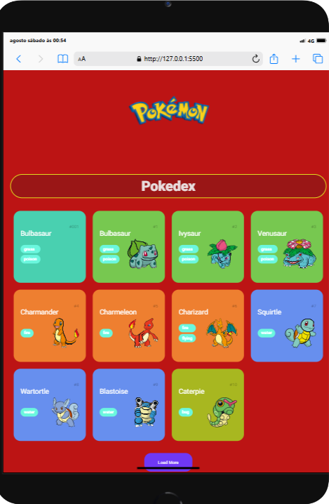

## Projeto Pokedéx

Essa pokédex simples foi criada usando HTML, CSS e JavaScript que consome uma API pública de Pokémon. O projeto permite visualizar responsivamente uma lista inicial de Pokémon com suas imagens e nomes, e inclui um botão para carregar mais Pokémon conforme o usuário desejar. 

